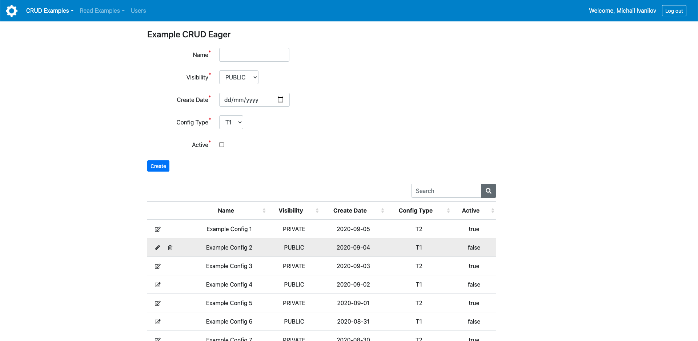

# Admin-UI
This project provides UI for an example configuration management that serves as a reference implementation for any other configuration management.  
Provided example demonstrates 4 use cases:
- CRUD eager/lazy
- Read eager/lazy

## Technology
Frontend is based on: Bootstrap, Bootstrap Table, jQuery.  
Backend is based on: Spring MVC with Thymeleaf, Spring Boot, Spring Security, Spring Data JPA, PostgreSQL.  
Frontend is stateful while Backend is stateless, meaning Admin-UI can be scaled out to run multiple instances, e.g. run multiple containers behind load balancer in the cloud.  
Admin-UI combines Server-side rendering using Spring MVC with Thymeleaf and Client-side rendering using Ajax.  

## Configure
Admin-UI integrates with Google Sign-In, to configure it for a local setup:
- [create OAuth2 credentials](https://developers.google.com/identity/sign-in/web/sign-in#create_authorization_credentials)
    - in "Authorized JavaScript origins" add uri `http://localhost:8080`
    - in "Authorized redirect URIs" add uri `http://localhost:8080/login/oauth2/code/google` 
- set created OAuth2 credentials to `OAUTH2_CLIENT_ID` and `OAUTH2_CLIENT_SECRET` env variables in [docker-compose.yml](docker-compose.yml)
- add your user with Google email to admin_ui database [user](src/main/resources/db/migration/V1_1__data.sql) table  

Also set `AUTH_TOKEN_SECRET` env variable in [docker-compose.yml](docker-compose.yml), e.g. `authTokenSecret`.  
After user authenticates with Google, Admin-UI generates auth token (JWT containing user's gmail address) which is stored in a cookie and is verified on every request.  
Generated auth token is signed with a secret configured in the app properties where it is set from the `AUTH_TOKEN_SECRET` env variable.

## Build
Maven is required to build Admin-UI.

### For development
To build admin-ui for development, execute:
```shell script
$ mvn clean install
```
This way `js` and `css` files will not get minified. 
It will ease development when admin-ui is running, in order to serve latest static resources like `js` and `css`, 
just build project to get static resources copied to `target`. 

### For deployment
To build admin-ui for deployment in e.g. production, execute:
```shell script
$ mvn clean install -P deploy
```
This way `js` and `css` files will get minified. 

## Run
Use Docker with Compose to run Admin-UI quickly.  
To run admin-ui, execute:  
```shell script
$ docker-compose up
```
This will build Docker image (executing first time) and start Docker containers of the admin-ui and database.  
Once admin-ui Docker container is up and app running inside it has started, open Admin-UI in the browser at `localhost:8080`

## Development
### Creating JS and CSS files
When creating new `js` and `css` files don't forget to list them in [pom minify-maven-plugin](pom.xml) and [index-local.properties](src/main/resources/index/index-local.properties)

### Database integration tests
Docker is required to run database integration tests. Testcontainers library runs PostgreSQL database instance locally in Docker.

### IDE configuration
IntelliJ:  
- [enable static files reload with Spring Boot Dev Tools](https://www.mkyong.com/spring-boot/intellij-idea-spring-boot-template-reload-is-not-working/)  
- set JavaScript version to `ECMAScript 6` under `Preferences > Languages & frameworks > Javascript`

### Naming conventions
Every CRUD/Read html page core elements (page, form, table) id and Thymeleaf fragments names are the same:  
```html
<div th:id="${pageConfig.fragments.page}" th:fragment="pageFragment">
    <div th:id="${pageConfig.fragments.form}" th:fragment="formFragment">
        <form th:id="${pageConfig.components.form}">
        ...
        </form>
    </div>
    <div th:id="${pageConfig.fragments.table}" th:fragment="tableFragment">
        <table th:id="${pageConfig.components.table}">
        ...
        </table>
    </div>
</div>
```

### HTML and Thymeleaf attributes ordering
For readability every HTML element has all native attributes listed first before Thymeleaf attributes,  
except `id` attribute (at least for Thymeleaf fragments) - it must go first e.g.:  
```html
<div th:id="${pageConfig.fragments.form}" class="mb-4" th:fragment="formFragment">
```

## Screenshot
